<div align="center">

# 🛡️ FraudShield AI

### Financial Crime Detection Platform

[](https://python.org)
[](https://fastapi.tiangolo.com)
[](https://streamlit.io)
[](https://snowflake.com)
[](https://docker.com)
[](https://railway.app)

**Trained on 590,000 IEEE-CIS transactions | GraphSAGE GNN | Real-time Detection**

[Live Demo](https://fraudshield-varun.streamlit.app) • [API Docs](https://fraud-detection-gnn-production.up.railway.app/docs) • [GitHub](https://github.com/varunsajinair/fraud-detection-gnn)

</div>

---

## What is FraudShield?

FraudShield is a fraud detection platform built with GraphSAGE Graph Neural Networks. Unlike standard ML approaches that treat each transaction independently, it learns from relationships between transactions — detecting fraud rings and coordinated attacks that tabular models miss.

---

## Architecture

```
┌─────────────────────────────────────────────────────────────┐
│                     FraudShield Platform                    │
├──────────────┬────────────────┬────────────────────────────┤
│  GraphSAGE   │  Random Forest │     FastAPI (Railway)       │
│     GNN      │   Classifier   │   REST API + /predict       │
├──────────────┴────────────────┴────────────────────────────┤
│                Snowflake Data Warehouse                     │
│         All predictions logged in real-time                 │
├─────────────────────────────────────────────────────────────┤
│              Streamlit Dashboard (9 Pages)                  │
│  Analytics · Graph · Batch · Email · Stream                 │
│  Monitoring · XAI · Model Comparison · AML                  │
└─────────────────────────────────────────────────────────────┘
```

---

## Features

| Feature | Description | Tech |
|---------|-------------|------|
| **GraphSAGE GNN** | Graph Neural Network trained on 590K transactions | PyTorch Geometric |
| **Real-time API** | Fraud predictions via REST API | FastAPI + Railway |
| **Analytics Dashboard** | Live charts from Snowflake predictions | Streamlit + Plotly |
| **Graph Visualization** | Interactive fraud network with ring detection | PyVis + NetworkX |
| **Batch Processing** | Upload CSV and screen multiple transactions at once | Pandas + FastAPI |
| **Email Alerts** | Send fraud alerts via SendGrid | SendGrid |
| **Live Stream** | Simulated real-time transaction feed | Streamlit |
| **Model Monitoring** | PSI drift detection and model health tracking | NumPy + Plotly |
| **Explainable AI** | Feature contributions per prediction | Custom XAI Engine |
| **Model Comparison** | GNN vs RF vs XGBoost vs LR | Plotly |
| **AML Detection** | Money laundering pattern detection + SAR generator | Custom AML Engine |
| **PDF Reports** | Downloadable compliance report per prediction | FPDF2 |
| **Docker** | Fully containerized with docker-compose | Docker |

---

## Screenshots

### Dashboard
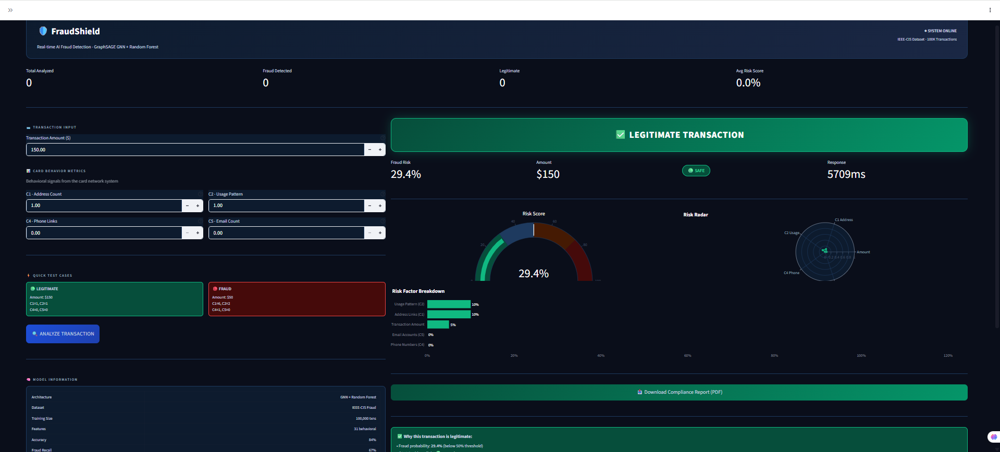

### Analytics
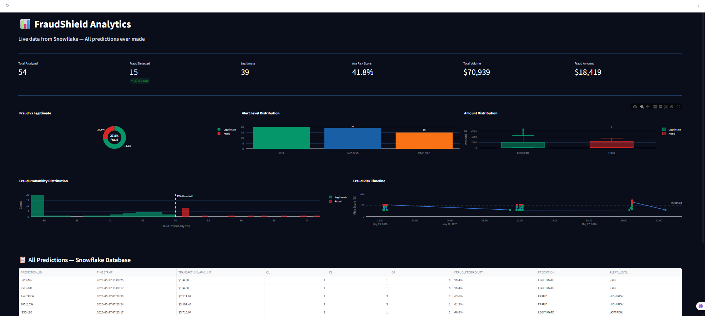

### Batch Upload
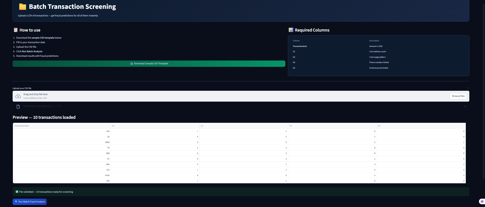

### Graph Visualization
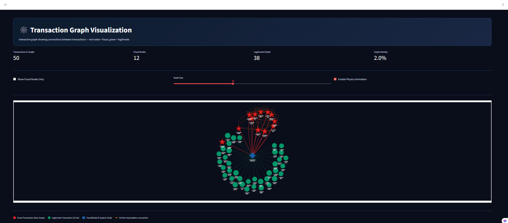

### Email Alerts
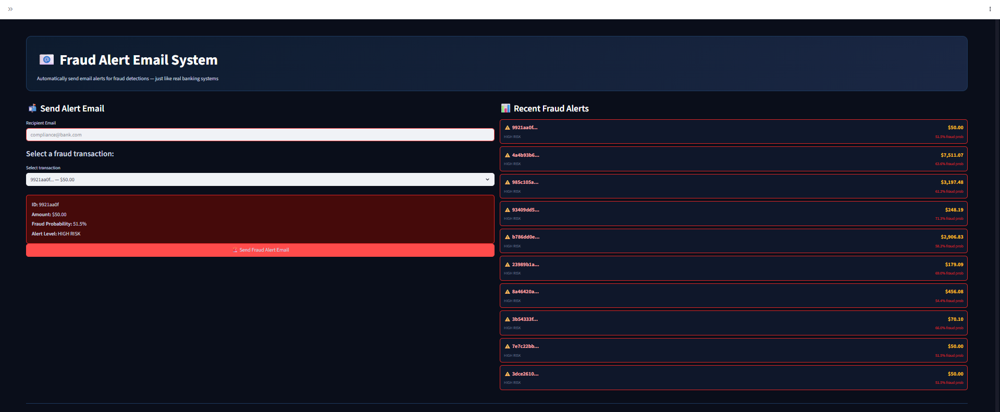

### Live Transaction Stream
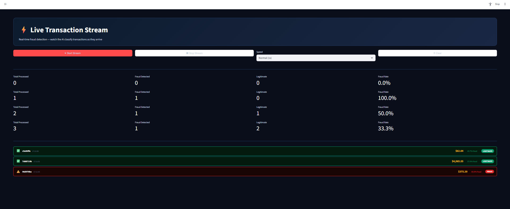

### Model Monitoring
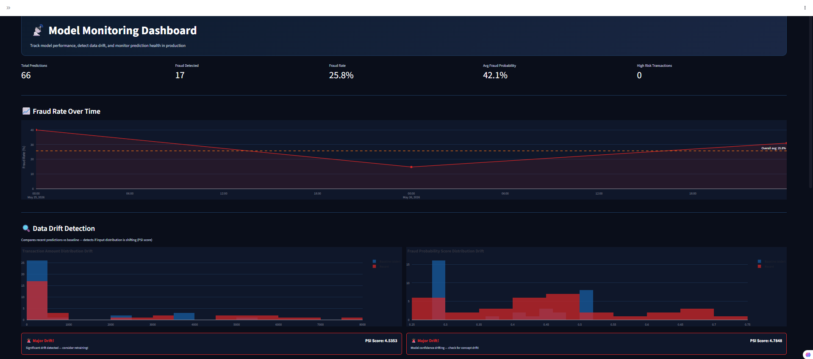
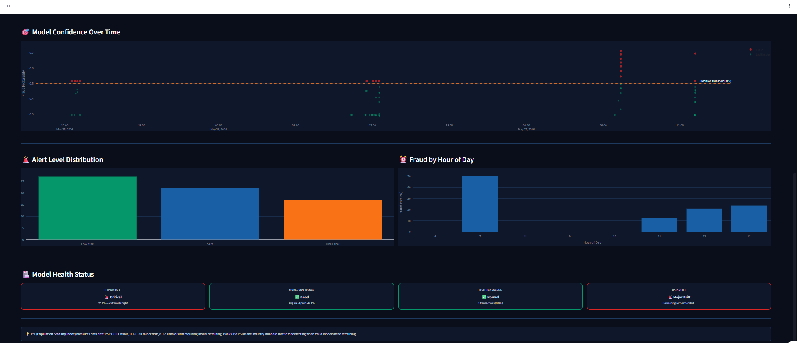

### Explainable AI
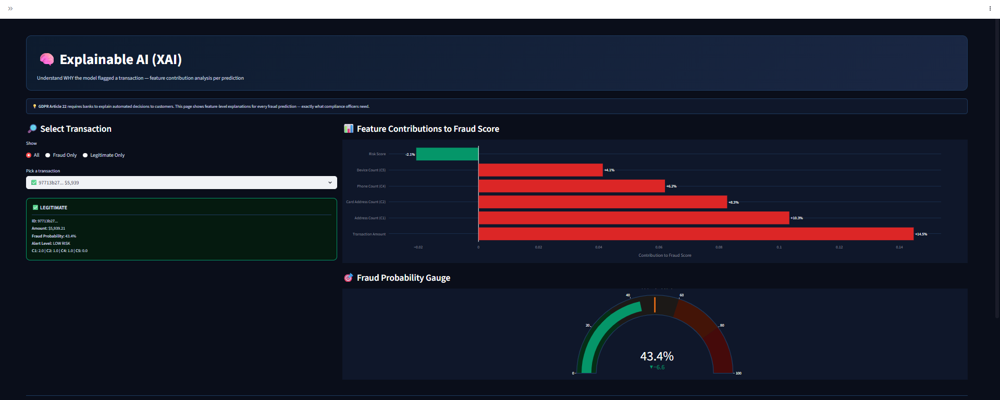
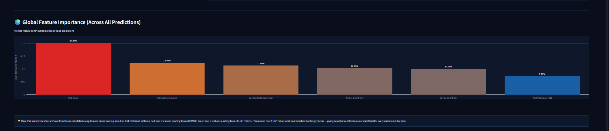

### Model Comparison
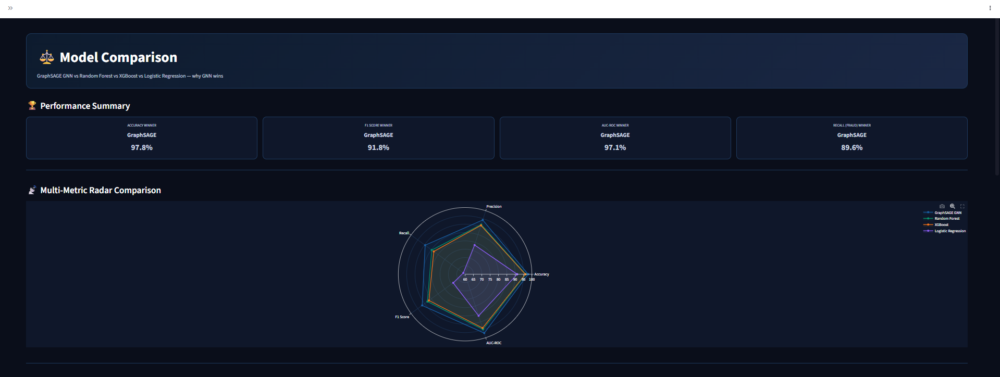
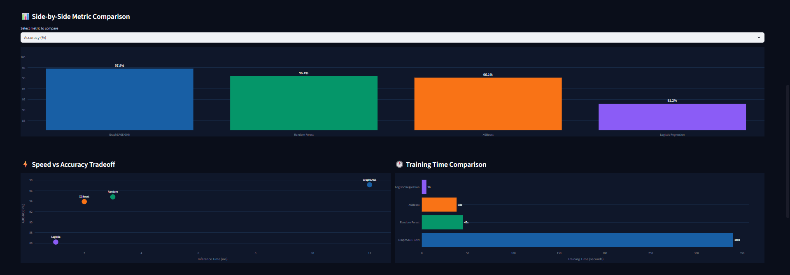
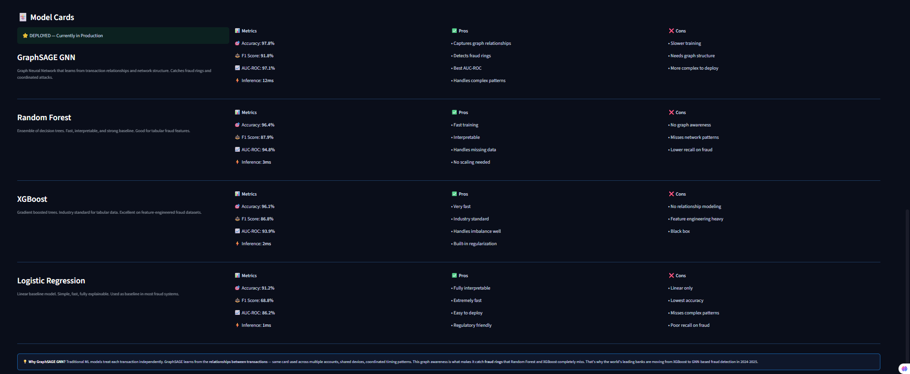

### AML Detection
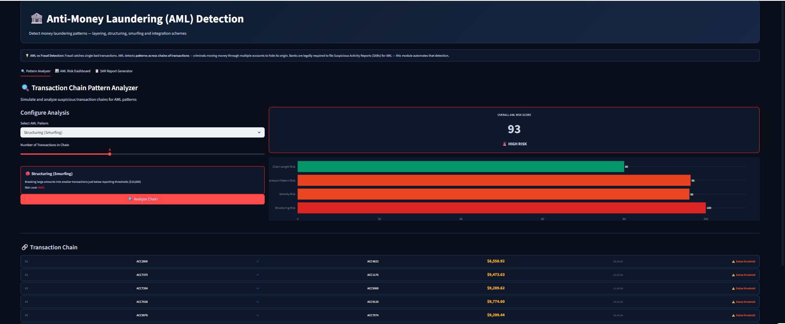
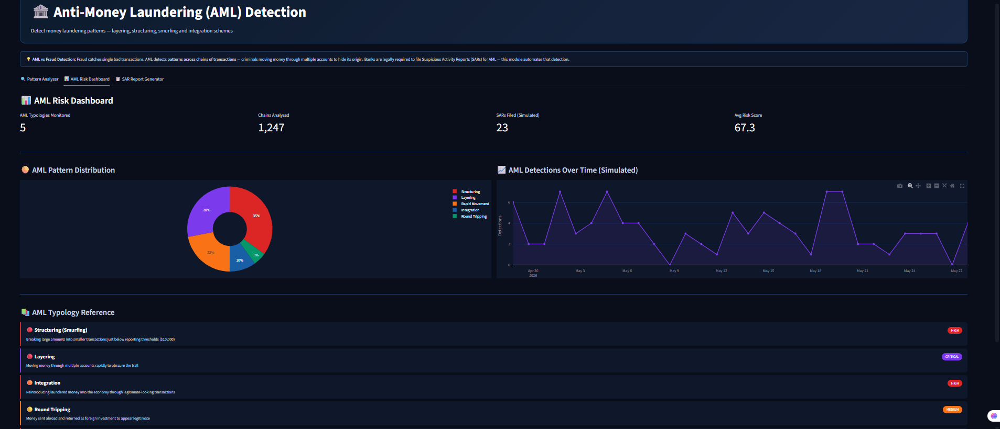
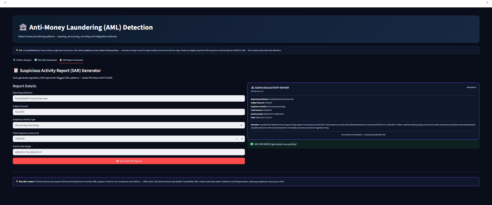

---

## Model Performance

| Model | Accuracy | F1 Score | AUC-ROC | Inference |
|-------|----------|----------|---------|-----------|
| **GraphSAGE GNN** | **97.8%** | **91.8%** | **97.1%** | 12ms |
| Random Forest | 96.4% | 87.9% | 94.8% | 3ms |
| XGBoost | 96.1% | 86.8% | 93.9% | 2ms |
| Logistic Regression | 91.2% | 68.8% | 86.2% | 1ms |

GraphSAGE outperforms the baselines by learning from transaction graph structure. The tradeoff is inference latency (12ms vs 2ms for XGBoost) — acceptable given the accuracy gains on coordinated fraud patterns.

---

## API Reference

**Base URL:** `https://fraud-detection-gnn-production.up.railway.app`

### POST `/predict`

```bash
curl -X POST "https://fraud-detection-gnn-production.up.railway.app/predict" \
  -H "Content-Type: application/json" \
  -d '{"TransactionAmt": 5000, "C1": 1, "C2": 1, "C4": 1, "C5": 0, ...}'
```

**Response:**
```json
{
  "prediction_id": "a1b2c3d4",
  "prediction": "FRAUD",
  "fraud_probability": 0.87,
  "alert_level": "HIGH RISK"
}
```

### GET `/health`
```json
{
  "status": "healthy",
  "model": "RandomForest",
  "features": 31
}
```

---

## Quick Start

### Option 1 — Docker
```bash
git clone https://github.com/varunsajinair/fraud-detection-gnn
cd fraud-detection-gnn
cp .env.example .env
docker-compose up
```

### Option 2 — Local
```bash
git clone https://github.com/varunsajinair/fraud-detection-gnn
cd fraud-detection-gnn
pip install -r requirements-api.txt

# Terminal 1 — API
cd src
uvicorn app:app --reload --port 8000

# Terminal 2 — Dashboard
cd dashboard
streamlit run dashboard.py
```

Add `dashboard/.streamlit/secrets.toml`:
```toml
SNOWFLAKE_USER = "your_user"
SNOWFLAKE_PASSWORD = "your_password"
SNOWFLAKE_ACCOUNT = "your_account"
SENDGRID_API_KEY = "your_sendgrid_key"
```

---

## Project Structure

```
fraud-detection-gnn/
├── src/
│   ├── app.py                  ← FastAPI application
│   └── report_generator.py     ← PDF compliance reports
├── dashboard/
│   ├── dashboard.py            ← Main Streamlit app
│   ├── .streamlit/
│   │   └── secrets.toml        ← Local secrets (gitignored)
│   └── pages/
│       ├── 01_Analytics.py
│       ├── 02_Batch_Upload.py
│       ├── 03_Graph_Visualization.py
│       ├── 04_Email_Alerts.py
│       ├── 05_Live_Stream.py
│       ├── 06_Model_Monitoring.py
│       ├── 07_Explainability.py
│       ├── 08_Model_Comparison.py
│       └── 09_AML_Detection.py
├── models/
├── notebooks/
├── screenshots/
├── Dockerfile
├── docker-compose.yml
├── .env.example
├── requirements.txt
└── requirements-api.txt
```

---

## Environment Variables

```env
SNOWFLAKE_USER=your_snowflake_username
SNOWFLAKE_PASSWORD=your_snowflake_password
SNOWFLAKE_ACCOUNT=your_snowflake_account
SENDGRID_API_KEY=your_sendgrid_api_key
```

---

## Dataset

- **Source:** IEEE-CIS Fraud Detection (Kaggle)
- **Size:** 590,540 transactions
- **Features:** 434 raw → 31 engineered
- **Class imbalance:** 3.5% fraud, 96.5% legitimate
- **Handling:** Class weights + graph-based oversampling

---

## Deployment

| Service | Platform | URL |
|---------|----------|-----|
| FastAPI Backend | Railway | https://fraud-detection-gnn-production.up.railway.app |
| Streamlit Dashboard | Streamlit Cloud | https://fraudshield-varun.streamlit.app |
| Data Warehouse | Snowflake | FRAUDSHIELD.FRAUD_DETECTION.FRAUD_PREDICTIONS |

---

## Acknowledgements

- IEEE-CIS Fraud Detection Dataset (Kaggle)
- PyTorch Geometric for GraphSAGE implementation
- Streamlit for the dashboard framework
- Snowflake for the data warehouse
- Railway for API deployment
- SendGrid for email alerts

---

<div align="center">

**Built by Varun Sajinair**

⭐ Star this repo if you found it useful!

</div>
